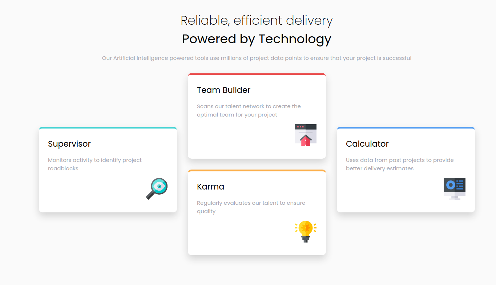

# Frontend Mentor - Four Card Feature Section

Four card feature section design from the website Frontend Mentor.
https://www.frontendmentor.io/challenges/four-card-feature-section-weK1eFYK

Again I used this tool: https://griddy.io/ cause it's my third time to use the grid on CSS.

This is the preview I made:

Live: 
